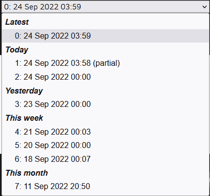
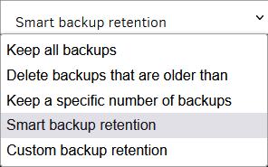
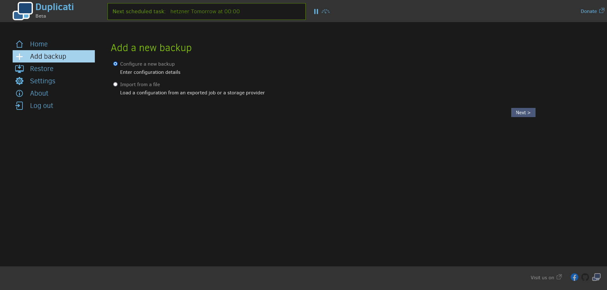
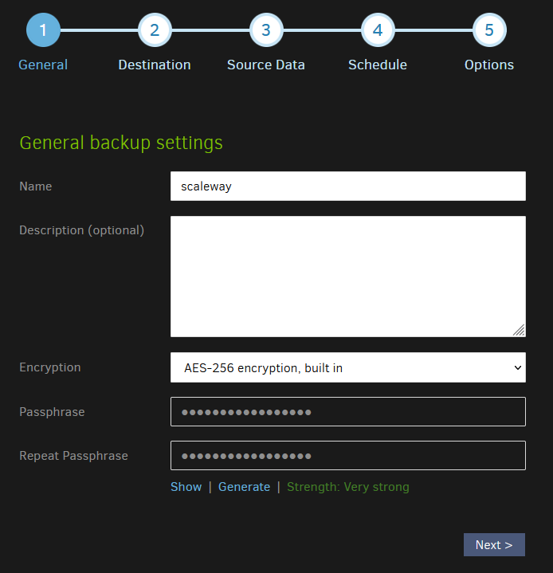
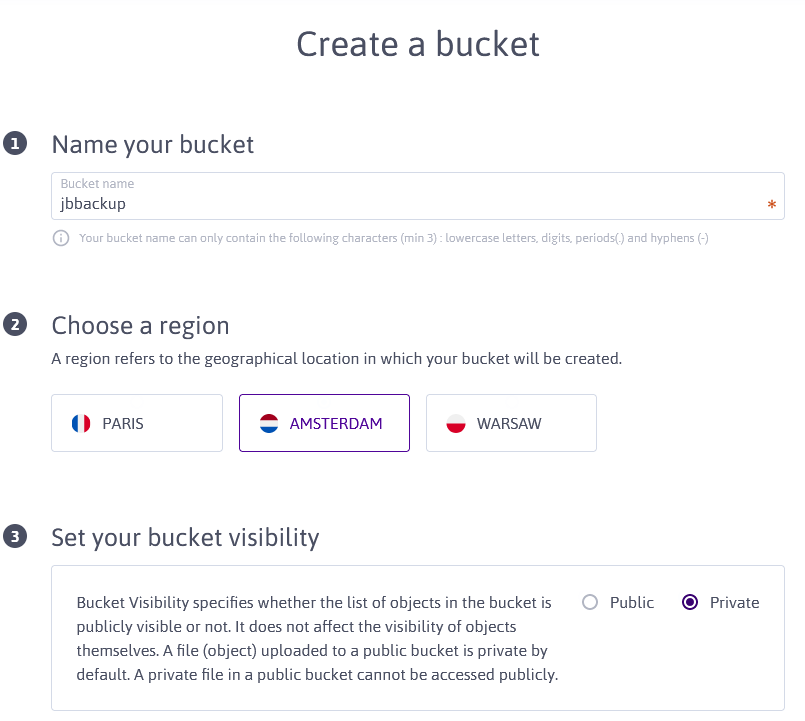
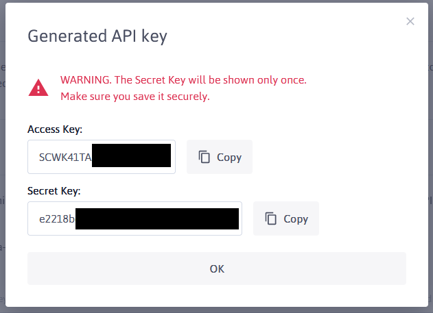
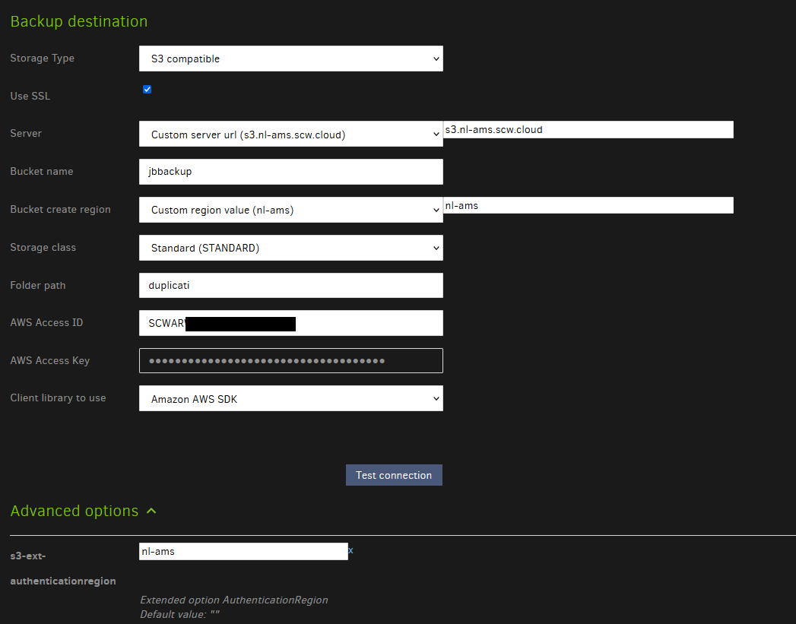
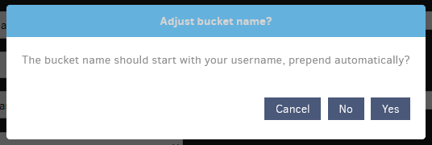
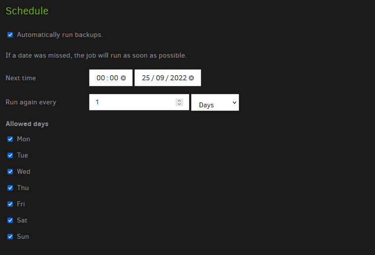
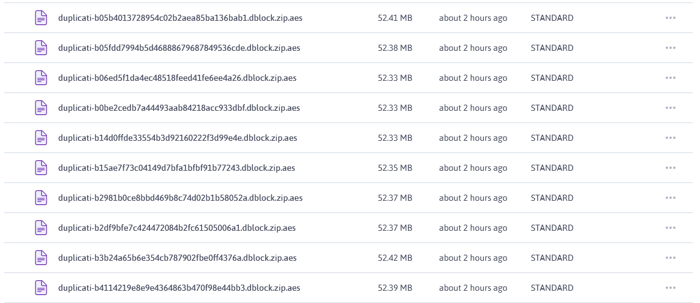

## Update: 2023-04-17
Use Duplicati at your own risk, some users (myself included) have issues restoring from Duplicati. Always test your backups beforehand.

---

What's the point in carefully crafting a beautiful homeserver if one mistype or downloading a dodgy program can ruin it all? A backup solution is vital to protect your important data.

Not just any backup though - An encrypted, incremental backup following the 3-2-1 rule is the best way to make sure your files are properly safe from disaster - [Duplicati](https://www.duplicati.com/) is great for this. It provides an easy way to backup encrypted copies of your data, incrementally on many storage providers.

## Why are incremental backups important?

Incremental backups allow you to restore to a specific point in time as each "backup" only stores what files were changed and how. This not only allows you to save space over backing up the same files over and over again but it gives you control of what version of your files to restore.



Duplicati has a few settings for how long to retain these files in order to find a good balance between the right frequency and backlog of backups without taking up excessive space.



I personally like the `smart backup retention` option as it gives me the best choice of when to restore without taking up too much storage.


## Why are encrypted backups important?

Encrypted backups ensure that if your backup location was compromised the attacker can't access your data without a passphrase. 

Duplicati allows you to choose from
 + No encryption
 + AES-256 encryption
 + GNU Privacy Guard

## How to use Scaleway with Duplicati?

I like to use Scaleway as **one of** my backup locations (along with Google Drive, a local backup, OneDrive and a VPS) due to their [free 75GB S3 bucket](https://www.scaleway.com/en/pricing/?tags=storage). This is plenty for me who just backs up my [Plex](https://www.plex.tv/) and [*arr](https://github.com/rustyshackleford36/locatarr) databases, totalling 1.5GB (Make sure to exclude your Plex Cache directory from backups as this is easy to regenerate but takes up a lot of storage)

### Install Duplicati

Follow [this guide](https://duplicati.readthedocs.io/en/latest/02-installation/) to install Duplicati - I personally use Docker Compose.


#### My docker compose config file


```yml
version: "2.1"
services:
  duplicati:
    image: lscr.io/linuxserver/duplicati:latest
    container_name: duplicati
    environment:
      - PUID=1000
      - PGID=1000
      - TZ=Europe/London
    volumes:
      - ./config:/config
      - ./backups:/backups
      - /docker/arr/sonarr/data/Backups/scheduled:/source/sonarr
      - /docker/arr/radarr/data/Backups/scheduled:/source/radarr
      - /docker/plex/config/Library:/source/plex
      - /docker/arr/sabnzbd/sabnzbd.ini:/source/sabnzbd/sabnzbd.ini
    ports:
      - 8200:8200 # I then use Caddy on a VPS to proxy this to backup.home.jackbailey.uk with IP restrictions
    restart: unless-stopped
```

### 1. Set up a backup

Select `Add backup` from the side menu, choose to configure a new backup and click next.



### 2. General Settings

Choose a name for your backup, I chose scaleway as each of my backups are named by their destination.

Set a description if you like, this could be what you're backing up.

Select your preferred encryption level, I chose AES-256.

Set a passphrase for the backup if you're using Encryption - make sure this is strong and you store it securely - You'll need this to restore the backup if something happens to your duplicati installation.




### 3. Backup Destination

#### Create a bucket on ScaleWay

+ [Create an Account on Scaleway](https://console.scaleway.com/register)
  + Verify your billing information if required
+ Create a bucket
  + Go to [Object Storage](https://console.scaleway.com/object-storage/buckets)
  + Click the plus icon to add a bucket
  +  Set your bucket name to something unique and memorable, I chose `jbbackup`
  + Choose a region, generally go for the closest to you but I went for Amsterdam as Paris was having API issues at the time of writing.
  + Set your bucket visibility to Private and create the bucket
    
    
+ Create an API Token to allow Duplicati to interact with this bucket
  + Click your name in the top right of Scaleway and click Credentials

    
  + Create `Generate new API key`
    + Set the purpose to Duplicati if you like - it'll just help you remember why you created the key
  + Make a note of your Access Key and Secret Key - You'll need these later
    
    
  + Click OK to finish up

#### Connect your bucket to Duplicati

+ Set your `Storage Type` to `S3 Compatible`
+ Check the box to `Use SSL `
+ Set your server to `s3.{REGION}.scw.cloud` - You can find your `REGION` code on the backup settings page for your bucket under Bucket Endpoint.
+ Set your `Bucket Name` to your Scaleway bucket name that you set earlier - mine is `jbbackup`
+ Set your `Bucket Create Region` to a custom value which is the same as `REGION` earlier - mine is `nl-ams` (Netherlands - Amsterdam )
+ Set your `Storage Class` to `Standard (STANDARD)`
+ Set your `Folder path` to what folder you want your backup files in, I set it to `duplicati`
+ Set your `AWS Access ID` to your Scaleway Access Key you made a note of earlier
+ Set your `AWS Access key` to your Scaleway Secret Key you made a note of earlier
+ Set `Client library to use` to `Amazon AWS SDK`

I had problems with Duplicati trying to use a us-based bucket still so I had to set `s3-ext-authenticationregion` to `nl-ams`.



You can also click the 3 dots icon in the top right and click `Import Destination URL` and paste in the URL, replacing each `{value}` with your own (Don't include the `{}`).

```
s3s://{BUCKET_NAME}/duplicati?s3-server-name=s3.{REGION}.scw.cloud&s3-location-constraint={REGION}&s3-storage-class=STANDARD&s3-client=aws&auth-username={SCALEWAY_ACCESS_KEY}&auth-password={SCALEWAY_SECRET_KEY}&s3-ext-authenticationregion={REGION}
```

Then feel free to test your connection and if it works you can carry on.

If duplicati asks the following:



Say No.

### 4. Source Data

Select your source data here, I just picked `/source/` which is the volume I mounted with all the files I want to backup in my Docker Compose file.

I also added a couple filters to exclude Plex's Cache and Codecs as there's no reason to back them up.


### 5. Schedule

Then set a backup schedule, this is completely up to you.



### 6. Options

Set this to your liking; I left the `Remote volume size` as default and set `Backup Retention` to `Smart backup retention`.


### Test it all out

Save your configuration, click `run now` on your backup to create a backup now - If everything is set up correctly you should see the backup compress and back up your files and then upload them to Scaleway.


Then you can check they uploaded on the bucket explorer on Scaleway

